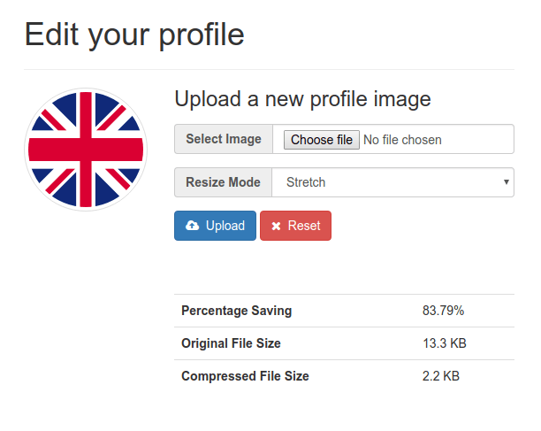

# Building a profile image uploader with automatic image compression in PHP

How to build a image profile uploader, with automatic image compression using the Zara 4 [image optimization](https://zara4.com) service.

View the accompanying
[blog post](https://blog.zara4.com/building-a-profile-image-uploader-with-automatic-image-compression-in-php)

## No Profile Image

## With Profile Image
